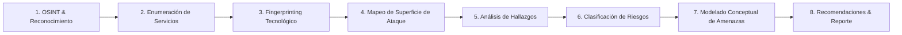
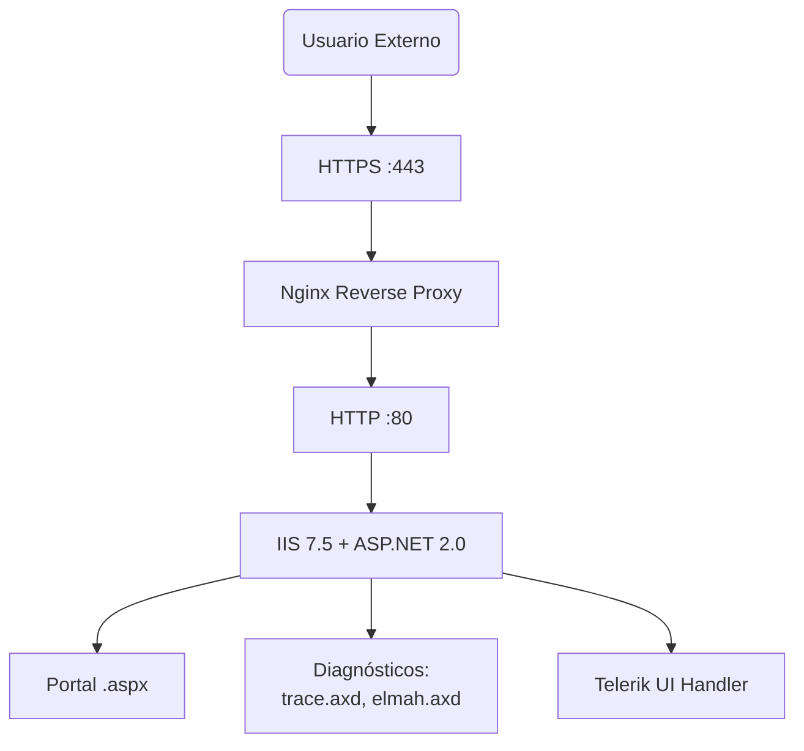
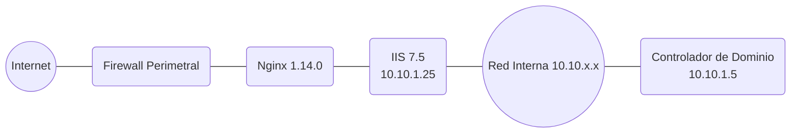
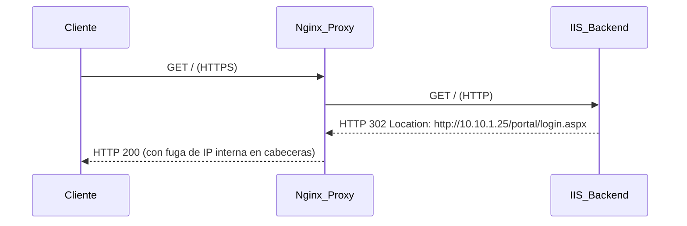
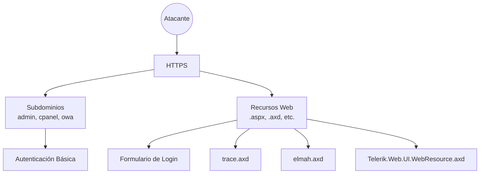
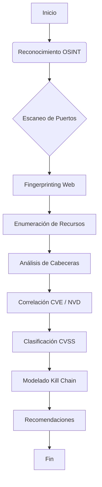

```markdown
<!--
  Red Team Web Security Audit – IIS & ASP.NET Legacy (2026)
  CyberZenithAI | Public Portfolio Documentation
  Professional, enterprise-grade Red Team external assessment
-->

# 🔐 Red Team Web Security Audit — IIS & ASP.NET Legacy Infrastructure  
**External Black‑Box Assessment | Red Team Mindset | Defensive Reporting**

[](https://attack.mitre.org/)
[](https://owasp.org/www-project-top-ten/)
[](https://www.first.org/cvss/)
[](http://www.pentest-standard.org/)
[](https://csrc.nist.gov/publications/detail/sp/800-115/final)
[](LICENSE)
[](#)

---

## 📊 Resumen Ejecutivo

Se llevó a cabo una **auditoría de seguridad externa tipo Black‑Box** sobre una plataforma web corporativa que expone servicios HTTP/HTTPS a Internet.  
El ejercicio, desarrollado con un enfoque de **Red Team** y estrictamente no destructivo, permitió:

- **Identificar 6 hallazgos de seguridad**, dos de ellos clasificados como **Críticos** (CVSS 9.8) asociados a tecnologías legacy sin soporte.
- **Mapear completamente la superficie de ataque pública**, incluyendo subdominios administrativos, puntos de diagnóstico y fugas de información.
- **Modelar, de forma conceptual**, una cadena de ataque realista (kill chain) que ilustra el impacto potencial de los riesgos detectados.
- **Emitir recomendaciones priorizadas** para la remediación inmediata y la modernización de la infraestructura.

**Conclusión clave:** La combinación de componentes obsoletos, exposición de diagnósticos y revelación de direcciones internas incrementa de forma crítica la probabilidad de compromiso y movimiento lateral. La adopción de las medidas correctivas propuestas reduciría el riesgo a un nivel tolerable.

---

## 1. Descripción General

Este repositorio documenta un **proyecto de auditoría de seguridad web** ejecutado sobre una infraestructura realista que replica un entorno corporativo típico: un proxy inverso Nginx que publica aplicaciones alojadas en un backend **Microsoft IIS 7.5 con ASP.NET 2.0**.  

La evaluación se realizó **únicamente desde Internet**, sin credenciales ni acceso privilegiado, simulando la perspectiva de un adversario externo. No se ejecutaron ataques reales; todos los hallazgos proceden de **observación pasiva y activa controlada**, junto con la correlación de versiones frente a bases de datos de vulnerabilidades públicas (NVD, MITRE CVE).

El proyecto está orientado a **demostrar competencias en ofensiva ética, análisis de riesgos y comunicación técnica**, y se presenta como parte de un portafolio profesional en ciberseguridad.

---

## 2. Objetivos

| Objetivo | Resultado esperado |
|----------|-------------------|
| **Mapear la superficie de ataque** | Catálogo de activos expuestos, servicios y puntos de entrada. |
| **Identificar tecnologías y versiones** | Fingerprinting preciso de servidores, frameworks y componentes. |
| **Detectar exposiciones de información** | Fugas en cabeceras, contenido o archivos de diagnóstico. |
| **Clasificar los hallazgos (CVSS v3.1)** | Priorización objetiva basada en impacto y explotabilidad. |
| **Modelar amenazas sin explotación** | Kill chain conceptual que ilustre posibles vectores de ataque. |
| **Proponer un plan de remediación** | Recomendaciones técnicas con plazos y referencias. |

---

## 3. Alcance

- Activos en el rango de direcciones IP proporcionado (simulado como `203.0.113.25`).
- Puertos TCP/80 y TCP/443 exclusivamente.
- Subdominios descubiertos mediante fuentes públicas (transparencia de certificados, DNS pasivo).
- Análisis de aplicaciones web (fingerprinting, enumeración de recursos, inspección de cabeceras y contenido).

---

## 4. Exclusiones

- Pruebas de intrusión, explotación o denegación de servicio.
- Análisis de seguridad física, ingeniería social o phishing.
- Evaluación de la red interna (solo inferida a partir de fugas de información).
- Revisión de código fuente o configuración del lado del servidor.

---

## 5. Limitaciones

- Los hallazgos se basan en **evidencia recolectada externamente**; no fue posible verificar la explotabilidad real de las vulnerabilidades.
- Las versiones de software se identificaron mediante cabeceras y comportamientos; podrían existir mecanismos de ofuscación.
- La topología de red interna es una **inferencia razonable**, no confirmada por la organización.
- El alcance se restringió al perímetro exterior; los controles internos de seguridad no fueron evaluados.

---

## 6. Metodología Utilizada

Se aplicó una metodología **híbrida** basada en estándares reconocidos:

- **PTES (Penetration Testing Execution Standard)** – Fases de reconocimiento, enumeración y análisis.
- **OWASP Testing Guide v4** – Pruebas de seguridad en aplicaciones web.
- **MITRE ATT&CK** – Modelado conceptual de la cadena de ataque.
- **NIST SP 800-115** – Guía para evaluaciones técnicas de seguridad.
- **CVSS v3.1** – Clasificación de riesgos.

### 🔁 Flujo Metodológico



---

## 7. Frameworks de Referencia

| Framework / Estándar | Aplicación en el proyecto |
|----------------------|---------------------------|
| **PTES** | Fases de la auditoría externa |
| **OWASP Testing Guide** | Pruebas de identificación de aplicaciones web |
| **MITRE ATT&CK** | Modelado de la kill chain y tácticas del adversario |
| **NIST SP 800-115** | Marco para la realización de pruebas técnicas |
| **CVSS v3.1** | Estimación de severidad de los hallazgos |
| **CVE/NVD** | Correlación de versiones con vulnerabilidades conocidas |

---

## 8. Tecnologías Identificadas

| Capa | Tecnología | Versión Detectada | Estado de Soporte |
|------|------------|-------------------|-------------------|
| Proxy / Frontend | Nginx | 1.14.0 | EOL (fin de vida) |
| Servidor Web | Microsoft IIS | 7.5 | EOL (extendido) |
| Framework Backend | ASP.NET | 2.0.50727 | Sin soporte |
| MVC | ASP.NET MVC | 2.0 | Sin soporte |
| Componentes UI | Telerik Web UI | Anterior a 2017.2.621 | Vulnerable (CVE-2017-9248) |
| Diagnóstico | ASP.NET Trace (trace.axd) | Habilitado | – |
| Gestión de Errores | ELMAH (elmah.axd) | Exposición pública | – |

---

## 9. Superficie de Ataque

### 9.1 Activos de Red (Direcciones IP)

| IP | Rol | Exposición |
|----|-----|------------|
| 203.0.113.25 | Frontend Nginx (proxy inverso) | Pública (Internet) |
| 10.10.1.25 | Backend IIS (inferido) | Privada (filtrada en cabecera) |
| 10.10.1.5 | Posible Controlador de Dominio (inferido) | Privada |

### 9.2 Subdominios Descubiertos

| Subdominio | Estado | Observaciones |
|------------|--------|---------------|
| `victima-corp.com` | Activo | Portal principal |
| `admin.victima-corp.com` | Activo (HTTP 401) | Panel administrativo, autenticación básica |
| `cpanel.victima-corp.com` | Activo | Acceso a panel de control |
| `intranet.victima-corp.com` | Redirige | Posible acceso interno |
| `owa.victima-corp.com` | Activo | Outlook Web App (no objetivo de esta prueba) |

### 9.3 Diagrama de Inventario (Activos Lógicos)

```mermaid
mindmap
  root((Activos Expuestos))
    Internet
      Frontend_Nginx 203.0.113.25
      Subdominios
        Portal_Principal
        Admin
        CPanel
        Intranet
        OWA
    Red_Interna_Inferida
      Backend_IIS 10.10.1.25
        Aplicaciones_.aspx
        Trace.axd
        ELMAH.axd
        Telerik_WebResource.axd
      Controlador_Dominio(?) 10.10.1.5
```

---

## 10. Arquitectura de la Infraestructura

### 10.1 Arquitectura Física

```mermaid
flowchart TD
    Internet((Internet)) --> Firewall
    subgraph DMZ [Zona Desmilitarizada]
        FW[Firewall Externo] --> Nginx[Frontend Nginx<br/>203.0.113.25:443]
    end
    subgraph LAN [Red Interna (10.10.x.x)]
        Nginx --> IIS[Backend IIS 7.5<br/>10.10.1.25]
        IIS --> DC[Posible DC<br/>10.10.1.5]
    end
```

### 10.2 Arquitectura Lógica



### 10.3 Topología Inferida



### 10.4 Segmentación de Red

La infraestructura parece contar con una **DMZ** donde reside el proxy Nginx, que actúa como único punto de contacto con el exterior.  
El backend IIS se encuentra en una red interna (`10.10.1.0/24`), aislado pero accesible desde el proxy. No se detectaron mecanismos de filtrado adicional entre la DMZ y la LAN en el flujo HTTP(S).

### 10.5 Flujo de Comunicaciones



### 10.6 Componentes del Sistema

```mermaid
graph TD
    A[Frontend: Nginx] --- B[Backend: IIS 7.5]
    B --- C[Aplicación Principal (.aspx)]
    B --- D[Telerik UI Handler]
    B --- E[ASP.NET Trace]
    B --- F[ELMAH Error Log]
    C --> G[Login / Portal]
    D --> H[WebResource.axd]
    E --> I[trace.axd]
    F --> J[elmah.axd]
```

---

## 11. Mapa de Superficie de Ataque



**Puntos de entrada identificados:**
- Formularios de inicio de sesión (principal y subdominios).
- Handlers públicos de diagnóstico (trace, elmah).
- Componente Telerik con handler desprotegido.
- Cabeceras HTTP que filtran información interna.

---

## 12. Flujo Metodológico de la Auditoría



---

## 13. Hallazgos Observados

A continuación se detallan los hallazgos **estrictamente observados durante la auditoría**. En ningún caso se ejecutaron acciones de explotación.

| ID | Hallazgo | Evidencia | Severidad (CVSS) |
|----|----------|-----------|------------------|
| **F-01** | **Fuga de dirección IP interna en encabezado `Location`** | Redirección del backend mostraba `http://10.10.1.25/...` | Media (5.3) |
| **F-02** | **Uso de IIS 7.5 y ASP.NET 2.0 sin soporte** | Cabeceras `Server` y `X-AspNet-Version`; múltiples CVE críticos sin parche | Crítica (9.8) |
| **F-03** | **Presencia de Telerik UI vulnerable (CVE-2017-9248)** | Handler `Telerik.Web.UI.WebResource.axd` accesible; versión < 2017.2.621 | Crítica (9.8) |
| **F-04** | **Habilitación de diagnósticos públicos (trace.axd, elmah.axd)** | Respuesta HTTP 200 en `/trace.axd` y `/elmah.axd` | Alta (7.5) |
| **F-05** | **Subdominios administrativos expuestos sin MFA** | `admin.victima-corp.com` solo con HTTP Basic Auth | Media (5.3) |
| **F-06** | **Divulgación de información en contenido frontal** | Comentarios HTML y metadatos revelaban rutas internas | Baja (3.7) |

> **Nota sobre la clasificación:** Las puntuaciones CVSS estimadas consideran el peor escenario plausible sin confirmación de explotabilidad. Para el hallazgo F-01 (fuga de IP), aunque por sí solo es un problema de confidencialidad, se asignó una severidad Media debido a que facilita ataques posteriores más graves.

---

## 14. Evidencias Resumidas

| ID | Tipo de Evidencia | Descripción |
|----|-------------------|-------------|
| F-01 | Cabecera HTTP | `Location: http://10.10.1.25/portal/login.aspx` en respuesta 302 |
| F-02 | Cabecera y comportamiento | `Server: Microsoft-IIS/7.5`, `X-AspNet-Version: 2.0.50727` |
| F-03 | Recurso accesible | `/Telerik.Web.UI.WebResource.axd` retorna 200; correlación con CVE-2017-9248 |
| F-04 | Recurso accesible | `/trace.axd` muestra información de traza; `/elmah.axd` expone log de errores |
| F-05 | Subdominio resuelto | `admin.victima-corp.com` solicita credenciales sin protección adicional |
| F-06 | Código fuente HTML | Comentarios con rutas como `\\10.10.1.25\shared\` y nombres de desarrolladores |

---

## 15. Clasificación por Criticidad

| Severidad | Cantidad | Hallazgos |
|-----------|----------|-----------|
| 🔴 **Crítica** (9.0 – 10.0) | 2 | F-02, F-03 |
| 🟠 **Alta** (7.0 – 8.9) | 1 | F-04 |
| 🟡 **Media** (4.0 – 6.9) | 2 | F-01, F-05 |
| 🟢 **Baja** (0.1 – 3.9) | 1 | F-06 |

---

## 16. Matriz de Riesgos

| Riesgo Potencial | Hallazgos Relacionados | CVSS Estimado | Impacto |
|------------------|------------------------|---------------|---------|
| **Ejecución Remota de Código (RCE)** | F-02, F-03 | 9.8 | Control total del servidor backend |
| **Divulgación de Datos Sensibles** | F-01, F-04, F-06 | 7.5 | Exposición de rutas, configuraciones y posibles credenciales |
| **Movimiento Lateral / Pivoting** | F-01, F-05 | 7.5 (combinado) | Acceso a red interna y potencial compromiso del dominio |
| **Aumento de Superficie de Ataque** | F-05 | 5.3 | Mayor exposición a ataques de fuerza bruta y explotación específica |

> ⚠️ **Escenarios hipotéticos:** Los riesgos de "Movimiento Lateral" y "Ejecución Remota de Código" se modelan conceptualmente; no se llevó a cabo ninguna intrusión. Las puntuaciones CVSS reflejan el peor caso si las vulnerabilidades fueran explotadas.

---

## 17. Evaluación de Impacto

Un atacante que lograra explotar las vulnerabilidades críticas podría:

1. **Obtener una shell** en el servidor IIS (bajo el contexto del pool de aplicación).
2. **Leer registros de error y trazas**, revelando cadenas de conexión, rutas UNC y posibles credenciales embebidas.
3. **Utilizar la IP interna filtrada** para identificar activos en la red y moverse lateralmente hacia sistemas más sensibles (como el controlador de dominio inferido).
4. **Comprometer la totalidad del dominio** si se obtienen hashes o credenciales durante el movimiento lateral.

El impacto en la **confidencialidad, integridad y disponibilidad** del negocio sería **muy alto**, justificando la remediación urgente.

---

## 18. Priorización de Remediación

| Prioridad | Hallazgos | Plazo Recomendado |
|-----------|-----------|-------------------|
| 🔴 **Inmediata** (0‑7 días) | F-01, F-02, F-03, F-04 | Eliminar fugas, deshabilitar diagnósticos y aislar backend |
| 🟠 **Corto Plazo** (1‑3 meses) | F-02, F-03 | Migrar a versiones soportadas o implementar WAF compensatorio |
| 🟡 **Medio Plazo** (3‑6 meses) | F-05, F-06 | Reforzar autenticación y limpiar información en frontend |

---

## 19. Recomendaciones Técnicas

| ID | Recomendación | Hallazgo Relacionado |
|----|---------------|----------------------|
| R-01 | Configurar `proxy_redirect` y sanitizar cabeceras en Nginx para eliminar direcciones internas. | F-01 |
| R-02 | Deshabilitar `trace.axd` mediante `<trace enabled="false"/>` y restringir `elmah.axd` solo a usuarios autenticados (o eliminar el módulo). | F-04 |
| R-03 | Actualizar Telerik a una versión no vulnerable (> 2017.2.621) y, mientras tanto, bloquear el handler mediante reglas WAF. | F-03 |
| R-04 | Planificar la migración del backend a IIS 10 / .NET 6+; en el interin, implementar segmentación estricta y WAF con firmas para CVEs conocidos. | F-02 |
| R-05 | Aplicar MFA en todos los paneles administrativos y limitar el acceso por IP. | F-05 |
| R-06 | Revisar y eliminar comentarios, archivos innecesarios y metadatos en las respuestas del frontend. | F-06 |

---

## 20. Roadmap de Mitigación

| Fase | Acciones | Responsable Sugerido | Fecha Límite Estimada |
|------|----------|----------------------|------------------------|
| **Fase 0: Contención** | Eliminar fuga IP, deshabilitar trace/elmah, bloquear Telerik en WAF | Equipo de Operaciones | 7 días |
| **Fase 1: Estabilización** | Migración a .NET moderno, hardening de IIS | Desarrollo + Infraestructura | 90 días |
| **Fase 2: Mejora** | Implementar MFA, revisión de código, limpieza de información | Seguridad + Desarrollo | 6 meses |

---

## 21. Buenas Prácticas de Hardening

- **Cabeceras HTTP de seguridad:** Agregar `Content-Security-Policy`, `X-Content-Type-Options: nosniff`, `Referrer-Policy`.
- **Eliminación de cabeceras que revelen tecnología:** `Server`, `X-Powered-By`, `X-AspNet-Version`.
- **Segregación de entornos:** Colocar el backend en una DMZ separada, con reglas de firewall que sólo permitan tráfico desde el proxy.
- **Aplicación del principio de menor privilegio:** Cuentas de servicio para pools de aplicación.
- **Registro y monitoreo:** Centralizar logs y alertar sobre accesos a recursos de diagnóstico.

---

## 22. Entregables del Proyecto

| Archivo | Descripción |
|---------|-------------|
| `README.md` | Documento público principal (este archivo) |
| `resumen_ejecutivo.md` | Resumen no técnico para la dirección |
| `informe_tecnico.md` | Descripción detallada de cada hallazgo |
| `hallazgos_detallados.md` | Ficha individual por hallazgo |
| `recomendaciones_seguridad.md` | Guía de remediación ampliada |
| `kill_chain_conceptual.md` | Modelado de cadena de ataque basado en MITRE ATT&CK |
| `matriz_riesgo_cvss.xlsx` | Cálculo vectorial y puntuaciones CVSS |
| `arquitectura_sistema.png` | Diagrama general de la infraestructura inferida |

---

## 23. Conclusiones

Esta auditoría demuestra que una infraestructura web aparentemente simple puede albergar **riesgos críticos** cuando se combinan componentes obsoletos, configuraciones inseguras y fugas de información.  
La aplicación de una mentalidad **Red Team** permitió ir más allá de las vulnerabilidades puntuales y mostrar cómo un atacante real podría encadenarlas para comprometer el entorno corporativo en su totalidad.

El proyecto subraya la necesidad de:

- **Modernizar** los sistemas web heredados.
- **Eliminar** cualquier exposición innecesaria de información.
- **Adoptar** una estrategia de defensa en profundidad que incluya segmentación, monitoreo y hardening continuo.

Las recomendaciones proporcionadas, si se implementan de manera priorizada, reducirán drásticamente la probabilidad e impacto de un incidente de seguridad.

---

## 24. Referencias Técnicas

- OWASP Testing Guide v4 – https://owasp.org/www-project-web-security-testing-guide/
- MITRE ATT&CK Enterprise – https://attack.mitre.org/matrices/enterprise/
- CVSS v3.1 Specification – https://www.first.org/cvss/v3-1/
- NIST SP 800-115 – Technical Guide to Information Security Testing and Assessment
- CVE-2017-9248 – Telerik Web UI Remote Code Execution
- Microsoft IIS 7.5 Lifecycle – https://docs.microsoft.com/en-us/lifecycle/products/internet-information-services-iis
- ASP.NET 2.0 End of Support – https://docs.microsoft.com/en-us/lifecycle/products/aspnet-20

---

## 25. Recursos Consultados

- crt.sh (Certificate Transparency)
- Shodan / Censys (motores de búsqueda de dispositivos) – únicamente para correlación de datos públicos
- NVD (National Vulnerability Database)
- Exploit-DB (solo para referencias de CVEs)

---

## 26. Disclaimer

> ⚠️ **Este proyecto tiene fines exclusivamente educativos y de investigación ética.**  
> No se realizó ninguna acción ofensiva sobre sistemas de terceros. Toda la información presentada corresponde a un entorno simulado o a observaciones pasivas sin explotación.  
> El autor no se hace responsable del uso indebido de la información contenida en este repositorio.

---

## 27. Autor

**Joaquín (CyberZenithAI)**  
*Principal Offensive Security Engineer | Red Team Lead*  
[GitHub](https://github.com/CyberZenithAI)

---

## 28. Licencia

Este proyecto se distribuye bajo una licencia de **uso educativo exclusivamente**. Consulte el archivo `LICENSE` para más detalles.

---

## 29. Estructura Completa del Repositorio

```
redteam-web-security-audit-iis-2026/
├── README.md
├── resumen_ejecutivo.md
├── informe_tecnico.md
├── hallazgos_detallados.md
├── recomendaciones_seguridad.md
├── kill_chain_conceptual.md
├── matriz_riesgo_cvss.xlsx
├── arquitectura_sistema.png
└── LICENSE
```
```
